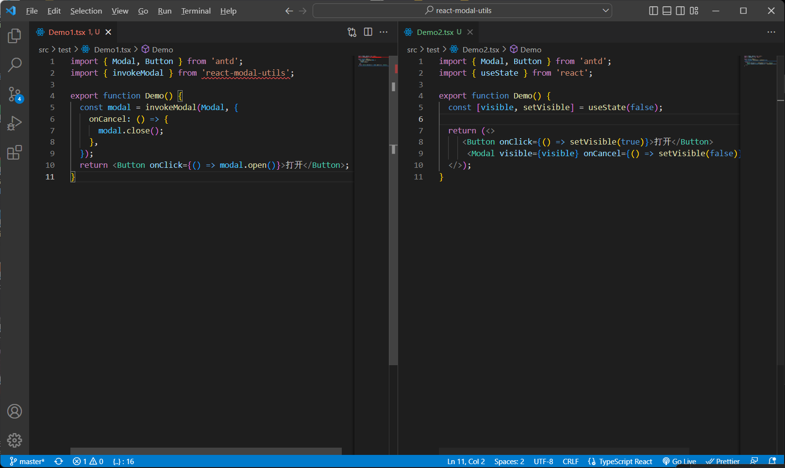
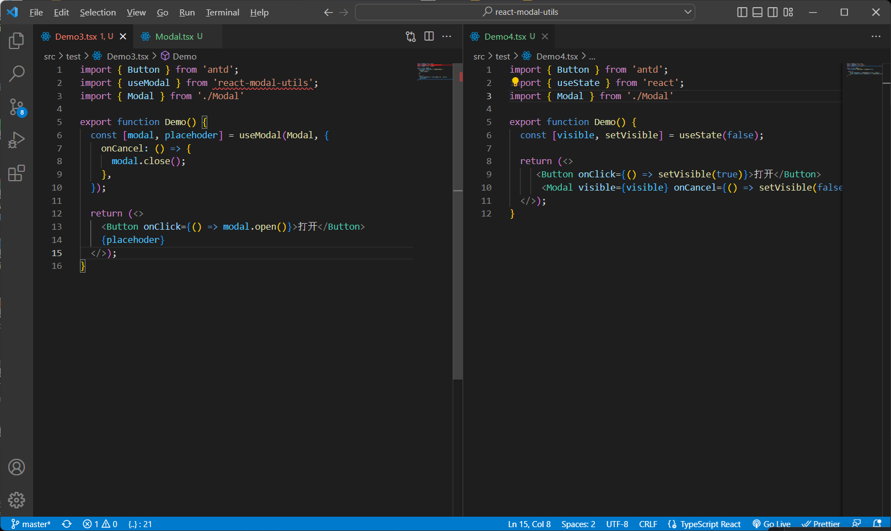
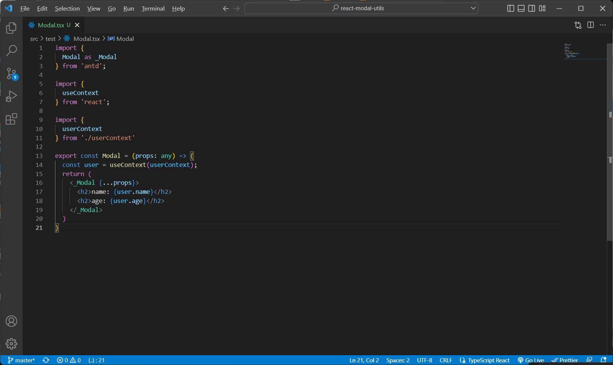

# 库信息

version：1.0.0-alpha.1
package-name：react-modal-util

# 背景

> 过去要使用一个 Modal 组件需要以下步骤
>
> 1. 引入 Modal
> 2. 视图中使用 Modal
> 3. 定义显隐状态
>
> 而 `3.` 是重复性的代码，我们能否将这种重复性的代码给封装起来简化受控

# 功能点

1. invokeModal

```tsx
import { Modal, Button } from 'antd';
import { invokeModal } from 'react-modal-utils';
function Demo() {
  const modal = invokeModal(Modal, {
    onCancel: () => {
      modal.close();
    },
  });
  return <Button onClick={() => modal.open()}>打开</Button>;
}
```

2. useModal Hook

```tsx
import { Modal, Button } from 'antd';
import { useModal } from 'react-modal-utils';
function Demo() {
  const [modal, placeholder] = useModal(Modal, {
    onCancel: () => {
      modal.close();
    },
  });
  return (
    <>
      <Button onClick={() => modal.open()}>打开</Button>
      {placeholder}
    </>
  );
}
```

# 工具库使用前后对比

1. invokeModal



2. useModal




